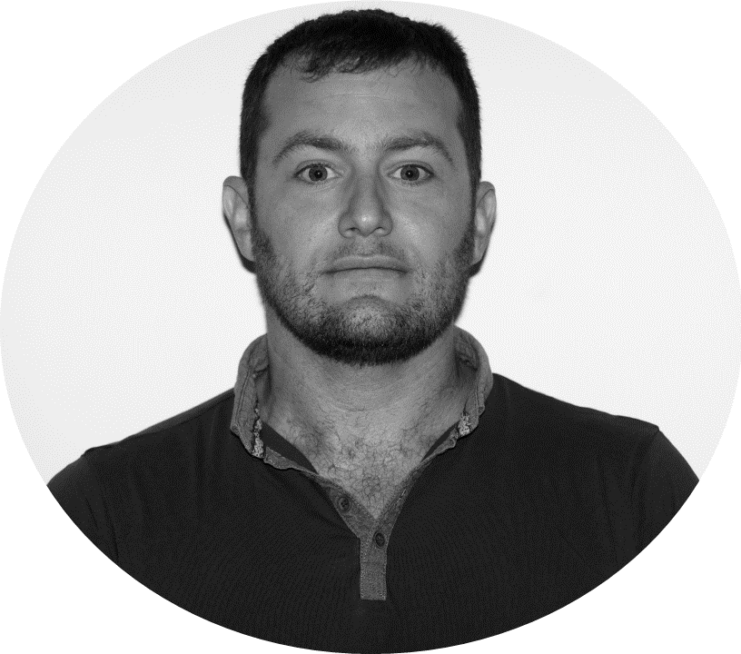
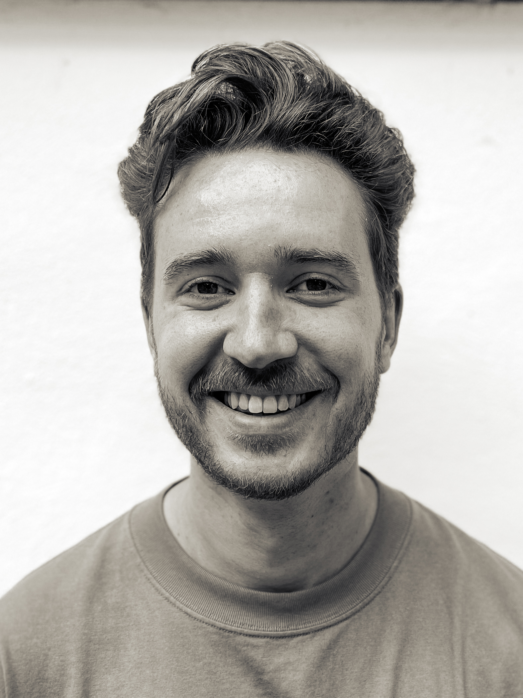
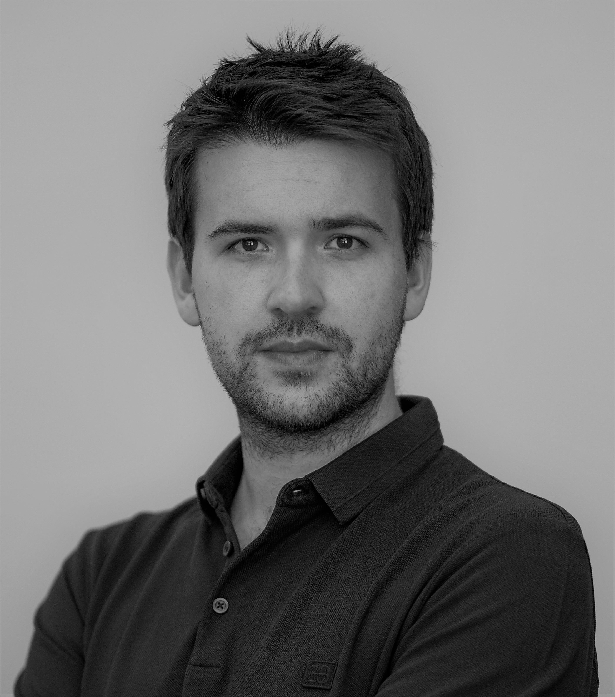

We are a group of 4 scientists, from various backgrounds, dedicated to the research of Theory-of-Mind and its application to AI.

  

     
    <b>Nitay Alon</b>
  

  

     
    <b>Joseph M. Barnby</b>
  

  

     
    <b>Reuth Mirsky</b>
  

  

     
    <b>Stefan Sarkadi</b>
  

